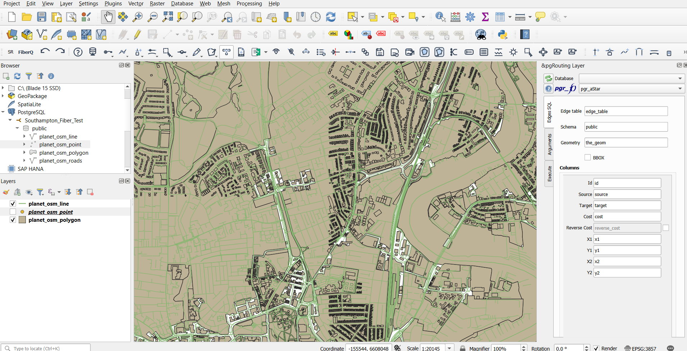

# Test Database Setup
There are no readily available PostGIS databases for testing on so a quick creation has to be done
using [osm2pgsql](https://osm2pgsql.org/).

For a test a slice of southampton was downloaded using [slice](https://slice.openstreetmap.us)

## PostGIS Database

[PostgreSQL](https://www.postgresql.org/) can be installed along with PGAdmin4 through the
PostgreSQL installer.

Once the database was created the postgis extension was installed with the query:
```sql
    CREATE EXTENSION postgis;
    CREATE EXTENSION hstore;
```
The `hstore` extension allows us to pack an unlimited amount of data into a single column. This is
done because there are lots of unique specific tags in open street map data e.g. `material=wood`,
`colour=green`. This data will be kept in a column called `Tags`.

The following command was run to input the .pbf data into the database using `osm2pgsql` (note that
the path and localhost port are specific to my machine):
```
osm2pgsql -d Fiber_Test -U postgres -H localhost -P 5433 -W --slim --hstore --multi-geometry -S ""C:\prog\industrial-consulting-project\osm2pgsql\osm2pgsql-bin\default.style"" southampton.pbf
```

The following is the database visualised using QGIS:



**Coordinate Reference System**
This is the mathematical formula used to flatten the curve of the earth onto a 2D map.

Open Street Map uses EPSG:4326 with units in degrees (lat/long).
The British National Grid uses EPSG:27700 which has units in meters.

This poses a problem as we want the output to be a csv with coordinates (lat/long) but predicting
the infastructure in this manner will distort the length of cables in meters. A solution could be to
do the mathematical prediction using the EPSG:27700 system and switch to ESPG:4326 for the export of
the data at the end.

## Docker Database

[Test Southampton Fiber Prediction](https://github.com/45inertia/Test-Southampton-Fiber-Prediction/tree/master)
is a repository containing the code for the test prediction. This was added here as was not sure where
to put it in the main repository and didn't want to break anything. 
