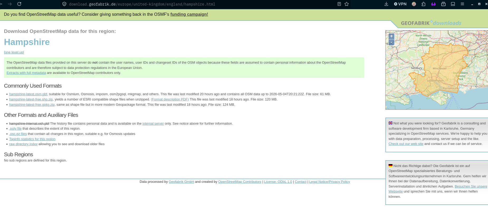
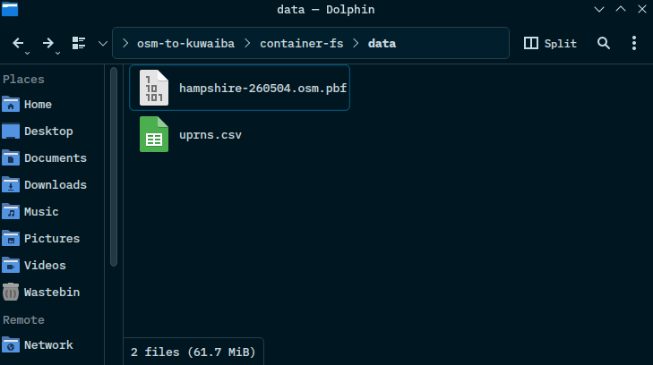
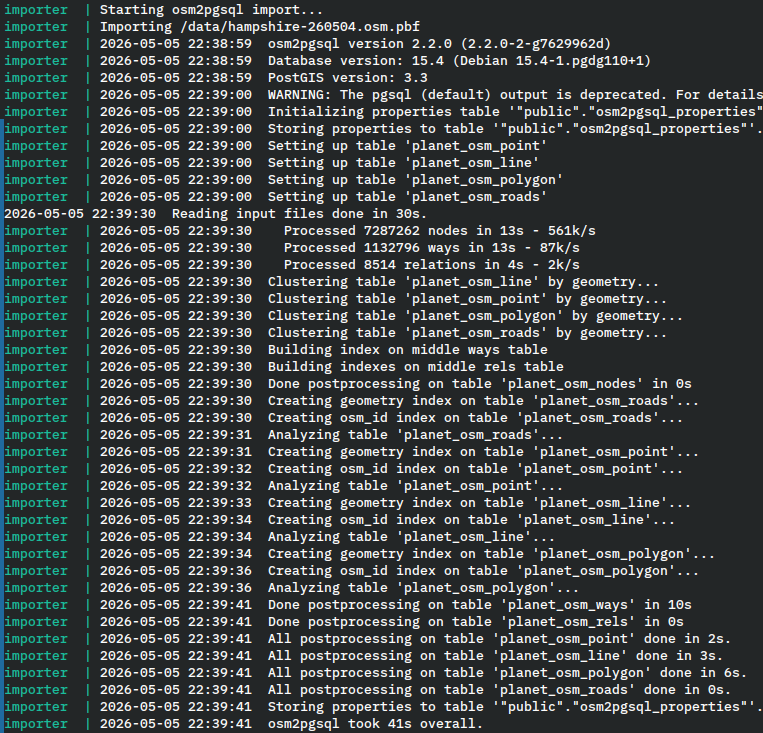
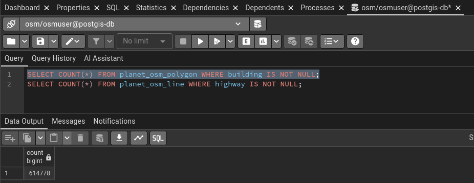
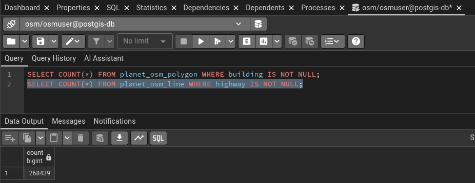
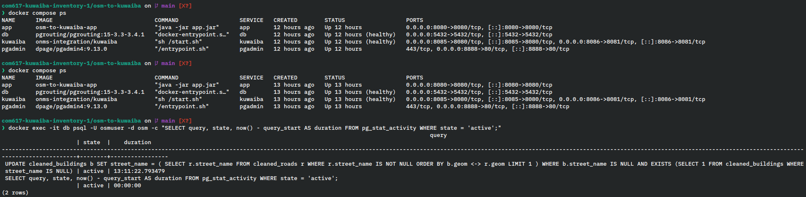
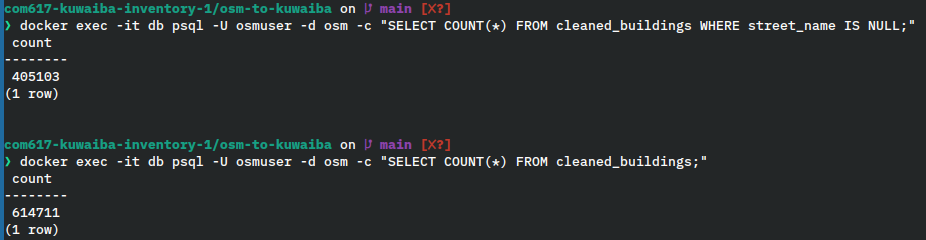
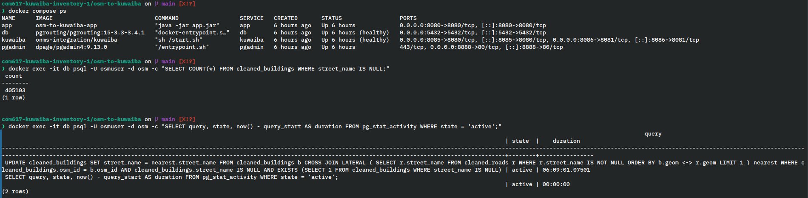

# GeoFabrik Hampshire Pipeline Test

## Overview

**Dataset**: Hampshire, England (`hampshire.osm.pbf`)
**Source**: Geofabrik

## 1. Data Export From GeoFabrik

The data from GeoFabrik comes in predefined areas with the smallest area being county level. Due to 
this the data gathered was from the whole of the Hampshire region.



This data was then placed in the `container-fs/data` folder where is was the only data source.



## 2. OSM Data Import

### 2.1 Importer Service Completion

The `importer` docker service ran `osm2pgsql` against the `hampshire.osm.pbf` and exited
successfully.



### 2.2 Raw OSM Table Record Counts

After the import, the raw OSM tables were populated. The following counts were recorded in
pgAdmin:

```sql
SELECT COUNT(*) FROM planet_osm_polygon WHERE building IS NOT NULL;
SELECT COUNT(*) FROM planet_osm_line WHERE highway IS NOT NULL;
```





## 3. Data Preparation

### 3.1 Failed Attempt 1

An attempt was made to run the Docker Compose stack but the application was taking a long time to
populate the tables from `createstables.sql`. The issue was pinpointed to the street name inference
query on the `cleaned_buildings` table.

```sql
UPDATE cleaned_buildings b
SET street_name = (
    SELECT r.street_name 
    FROM cleaned_roads r 
    WHERE r.street_name IS NOT NULL
    ORDER BY b.geom <-> r.geom
    LIMIT 1
)
WHERE b.street_name IS NULL
```

The problem was that the for every row in `cleaned_buildings` that had a null street name the inner
select query was being run that rescanned and reordered the entire `cleaned_roads` table to find the
nearest road for that single building before moving onto the next. 

On the hampshire dataset that has 405,103 buildings missing street names, this resulted in hundreds
of thousands of individual spatial searches. After 13 hours the query had not completed and only one
third of the houses had been completed as seen below.





#### The fix

The fix was to alter the query to use a `CROSS JOIN LATERAL` that PostgreSQL to evaluate the nearest
road search once per row using the spatial GIST index on `cleaned_roads.geom`. The same pattern was
applied to the street name update and the island removal query was rewritten to use `JOIN` rather
than `NOT EXISTS` subqueries.

```sql
UPDATE cleaned_buildings 
SET street_name = nearest.street_name
FROM cleaned_buildings b
CROSS JOIN LATERAL (
	SELECT r.street_name 
    FROM cleaned_roads r 
    WHERE r.street_name IS NOT NULL
    ORDER BY b.geom <-> r.geom
    LIMIT 1
) nearest
WHERE cleaned_buildings.osm_id = b.osm_id
AND cleaned_buildings.street_name IS NULL
AND EXISTS (SELECT 1 FROM cleaned_buildings WHERE street_name IS NULL);
```

### 3.2 Failed Attempt 2

With the mentioned changes, the second attempt at populating the tables was still taking a a long
time as can be seen below:



## 4. Summary

**Status**: Incomplete

The data preparation was not completed in a sufficient amount of time. The cause is the street name
inference step that performs a spatial nearest neighbour search for 405,103 buildings without an
OSM `addr:street` tag. 

This is identified as a performance limitation and finding a solution is a recommendation for 
future development. The system is validated for neighbourhood scale data but county scale data
requires further query opimization so the data preparation pipeline can complete in a reasonable
timeframe.

## 5. Pipeline Time Duration

|Stage|Start Time|End Time|Duration|
|-----|----------|--------|--------|
|Importer|22:38:59|22:39:41|42s|
|Data Preparation (createtables.sql)||||
|Prediction (predict/all)||||


### 5.1 Screenshot Evidence

**Importer Time**


