# Geofabrik Isle of Wight Pipeline Test

**Dataset**: Isle of Wight
**Source**: Geofabrik

The decision was made to test the pipeline on a larger dataset than osm2streets would allow but not
as large as hampshire as the pipeline was failing at that scale. The Isle of Wight data was chosen
as a middleground to test the capacity of the system.

## Data Gathering

The data was exported from the Geofabrik website and placed in `container-fs/data` where it is the
only data source.

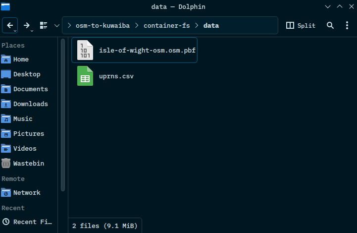

## OSM Data Import

### Importer Service Completion

The `importer` Docker service ran `osm2pgsql` against the `.osm.pbf` file and exited successfully.

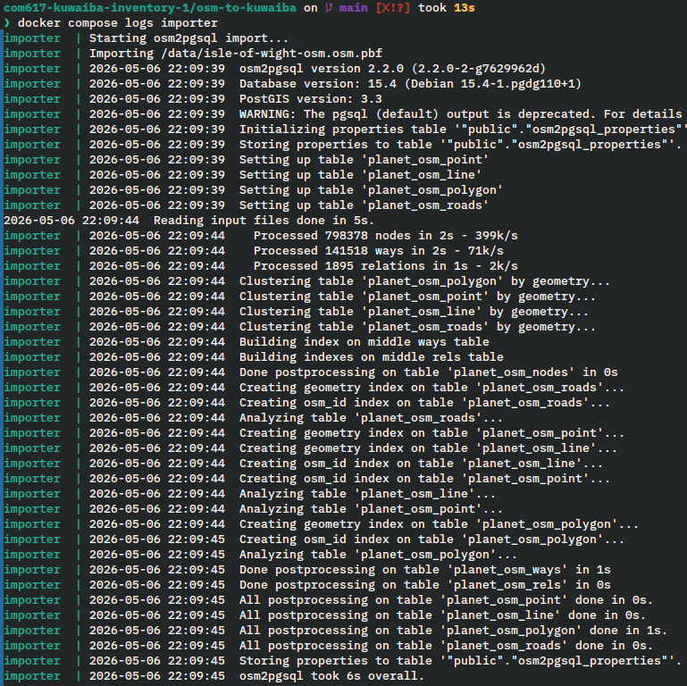

The following queries were run in pgAdmin to check the data count.

```sql
SELECT COUNT(*) FROM planet_osm_polygon WHERE building IS NOT NULL;
SELECT COUNT(*) FROM planet_osm_line WHERE highway IS NOT NULL;
```

The following is an example of the result:

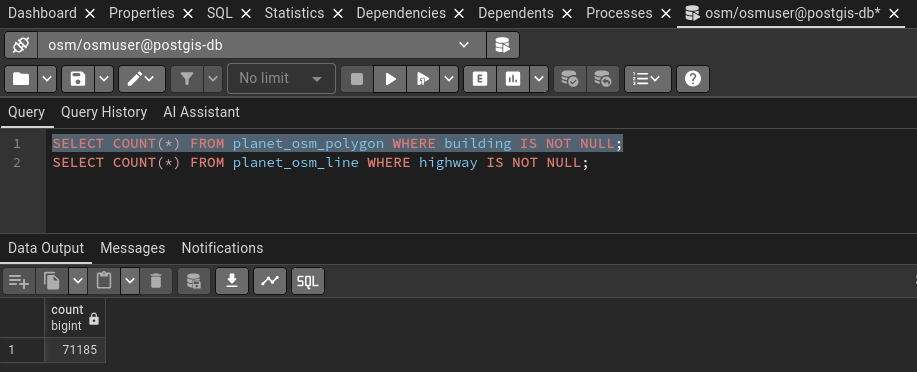

## Data Preparation

### Application Startup Log

The application started successfully as SchemaInitialization completed successfully.

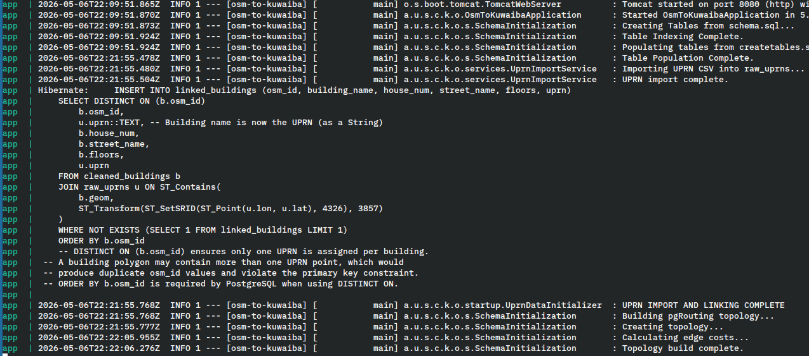

### Cleaned Data Record Counts

The following queries were used in pgAdmin to verify that data exists in the tables:

```sql
SELECT COUNT(*) FROM cleaned_buildings;
SELECT COUNT(*) FROM cleaned_roads;
SELECT COUNT(*) FROM building_drop_points;
SELECT COUNT(*) FROM linked_buildings;
SELECT COUNT(*) FROM noded_streets;
```

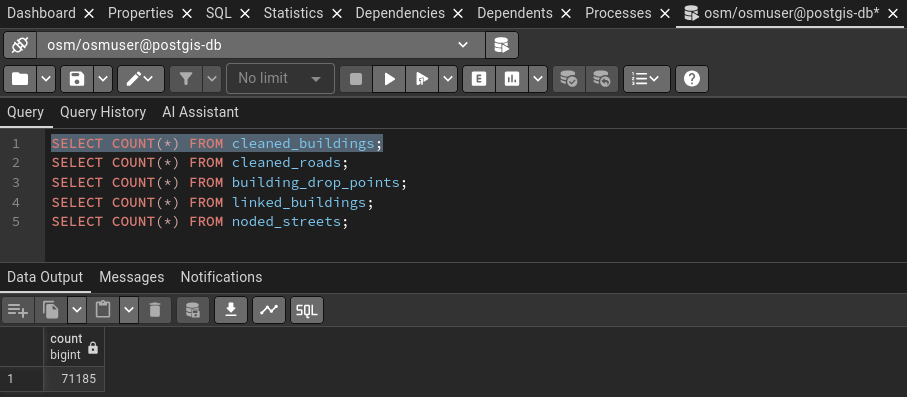

## Infrastructure Prediciton

### Prediction Trigger

The prediction was triggered via `POST /predict/all` successfully.

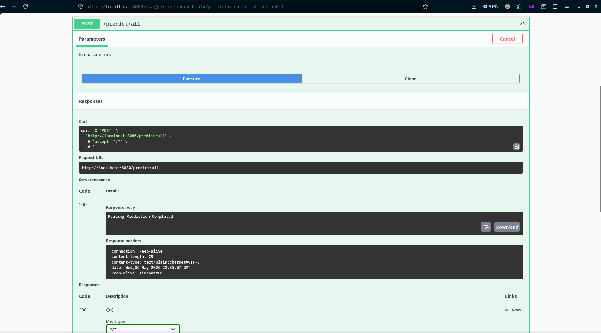

### Netowrk Point Record Count

Serialisable data was verified as present through the `GET network/points` endpoint.

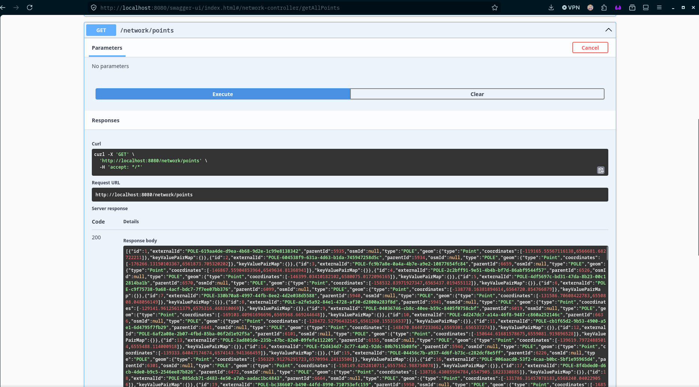

### Network Connection Record Count

Serialisable data was verified as present through the `GET network/connections` endpoint.

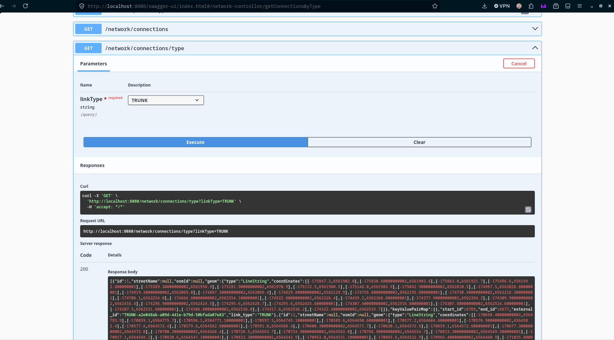

### Kuwaiba Requisition Sample

Data was verified as retrievable through the Kuwaiba Requisition endpoint
`GET /kuwaiba-network/kuwaibaRequisition?pageNo=0&pageSize=10`.

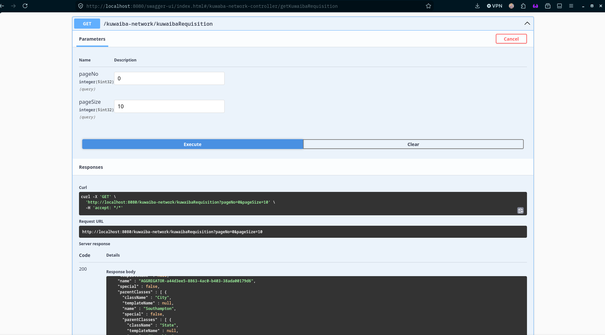

## Visualisation

The PostGIS database was loaded into QGIS to visually verify the predicted network.

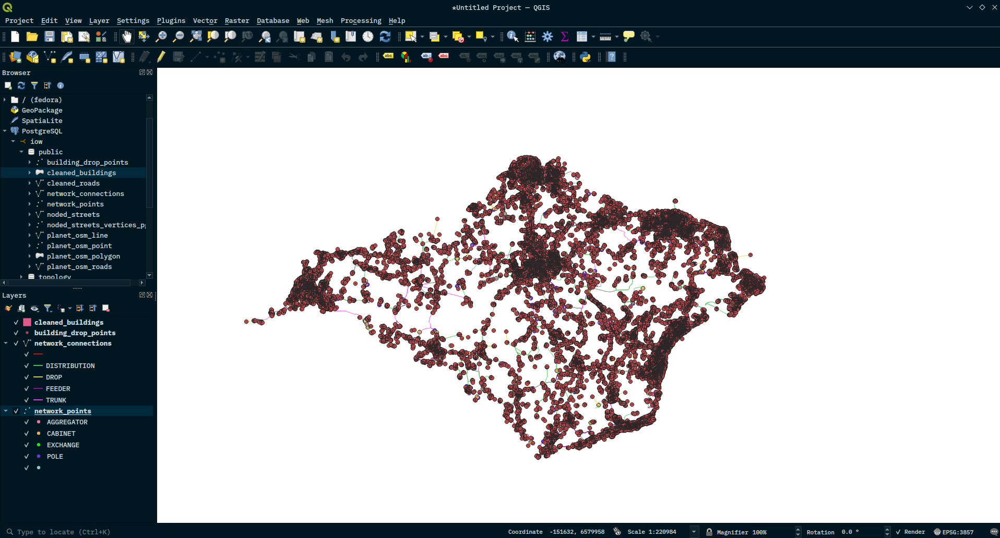

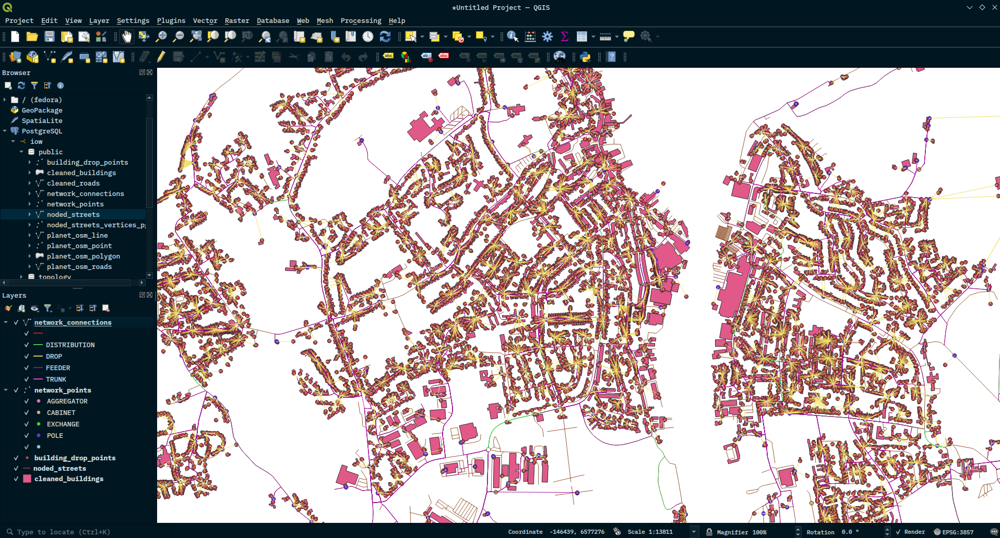

## Summary

| Stage | Result |
|-------|--------|
| OSM Export (OSM2Streets) | Completed |
| OSM Import (osm2pgsql) | Completed |
| Data Preparation | Completed |
| Infrastructure Prediction | Completed |
| REST API | Responding |
| Kuwaiba Export | Valid requisition produced |

## Pipeline Time Duration

The following is the time duration for the pipeline for the various stages:

|Stage|Start Time|End Time|Duration|
|-----|----------|--------|--------|
|Importer|22:09:39|22:09:45|6s|
|Data Preparation (createtables.sql)|22:09:51|22:22:06|12m 15s|
|Prediction (predict/all)|22:30:58|22:35:06|4m 18s|

### Prediction timestamp evidence

The first timestamp in the first image is when the prediction starts and the last timestamp in the
second image is when the prediction ends.

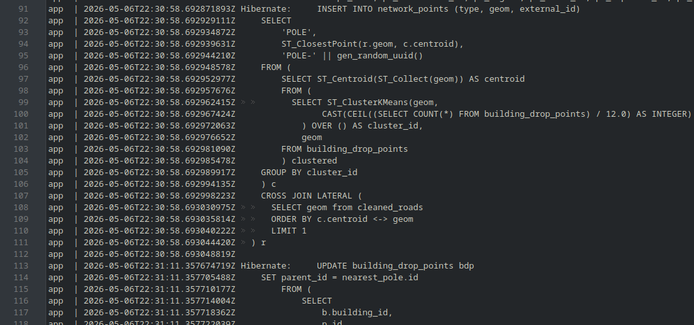

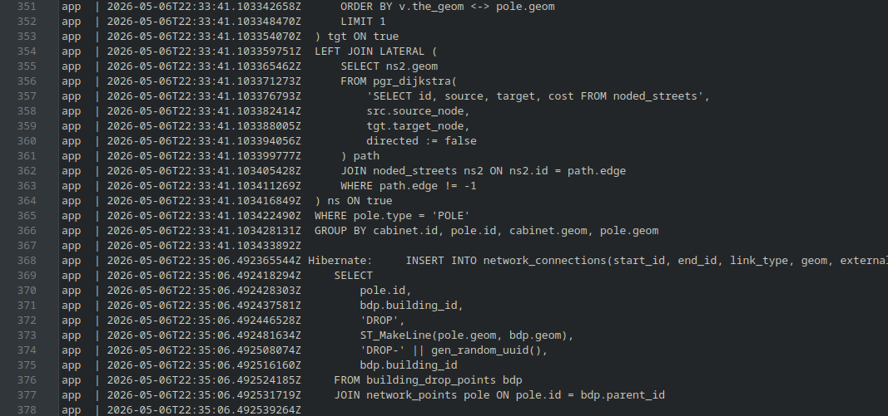