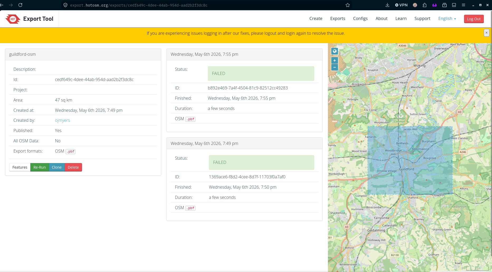
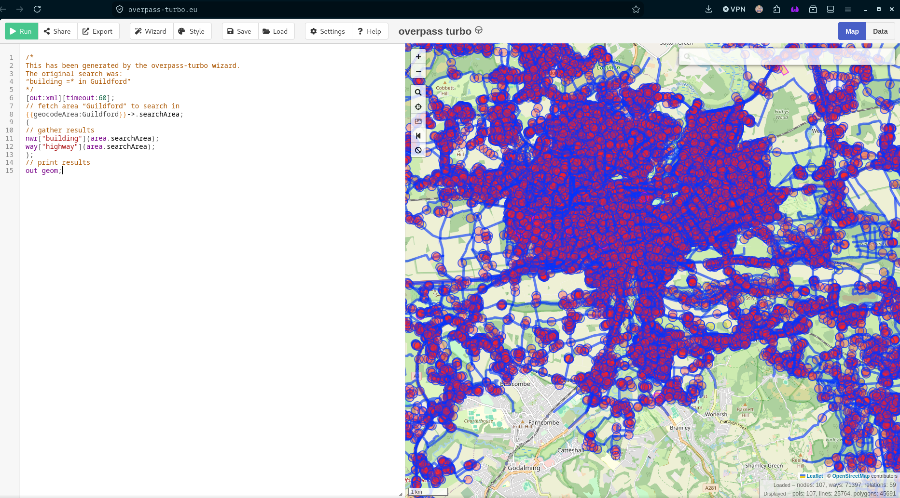
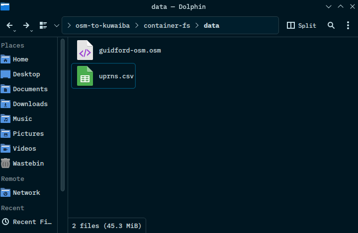
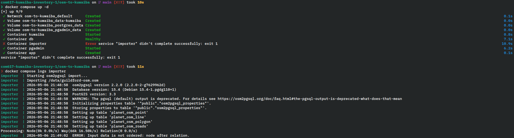

# HotOSM Export Pipeline Test

## Overview

**Dataset**: Guildford, 

## 1. Data Export From HotOSM Export

HotOSM was not responsive to the data gathering attempt as seen in the screenshot below:

The decision was made to use the Overpass API as that was where HotOSM retrieved its data from.
Below shows the data for Guildford being gathered by Overpass Turbo. Guildford data was chosen
as it provided an area larger than a neighbourhood and could stress test the pipeline.

This data was then placed in the `container-fs/data` folder where is was the only data source.

## 2. OSM Data Import

The data import threw an error due to the way that Overpass Turbo formats the data with nodes.
Therefore the conclusion was to rule out Overpass Turbo as an option for data gathering.

## 3. Summary

Neither HotOSM or Overpass Turbo proved viable options for the data gathering portion of this
project.