# osm2streets Pipeline Test

## 1. Data Export from osm2streets

### 1.1 Area Selection

The target area was was drawn in osm2streets Street Explorer by placing a boundary polygon around
the desired neighbourhood. For this test a neighbourhood in Winchester was chosen.

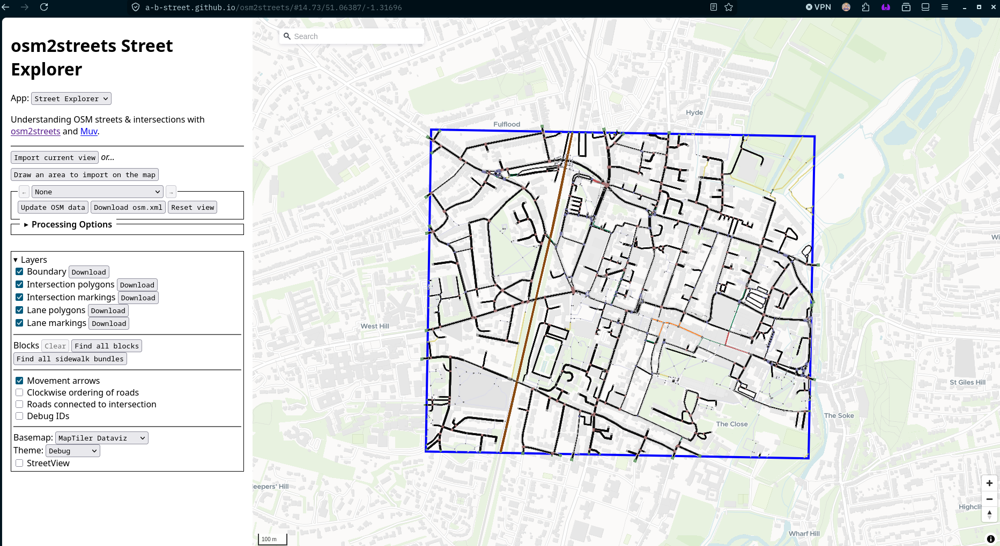

### 1.2 Export

The area was exported as a `.xml` file and placed in `container-fs/data`. The `bittern_park.xml`
file was removed first to ensure that only one data file was present.

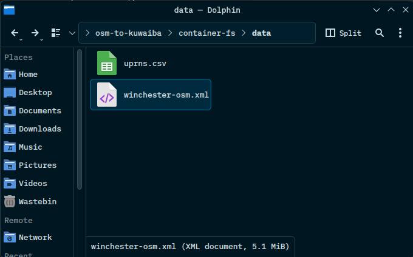

## 2. OSM data Import

### 2.1 Importer Service Completion

The `importer` Docker service ran `osm2pgsql` against the `.xml` file and exited successfully.

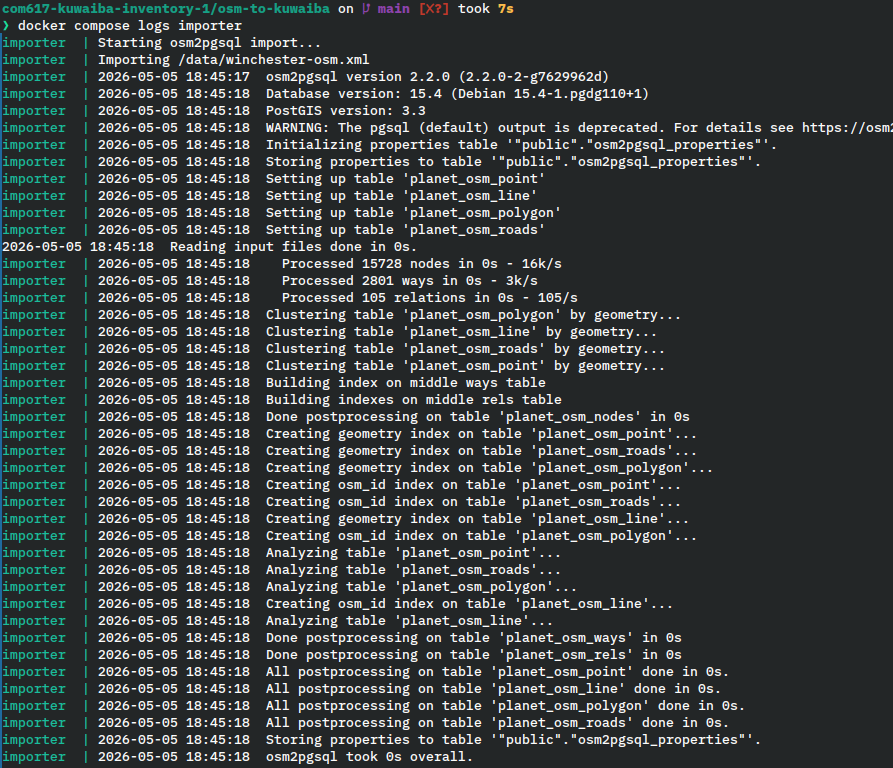

### 2.2 Raw OSM Table Record Counts

The following queries were run in pgAdmin to check the data count.

```sql
SELECT COUNT(*) FROM planet_osm_polygon WHERE building IS NOT NULL;
SELECT COUNT(*) FROM planet_osm_line WHERE highway IS NOT NULL;
```

Below is both queries results:

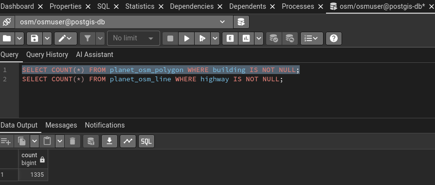
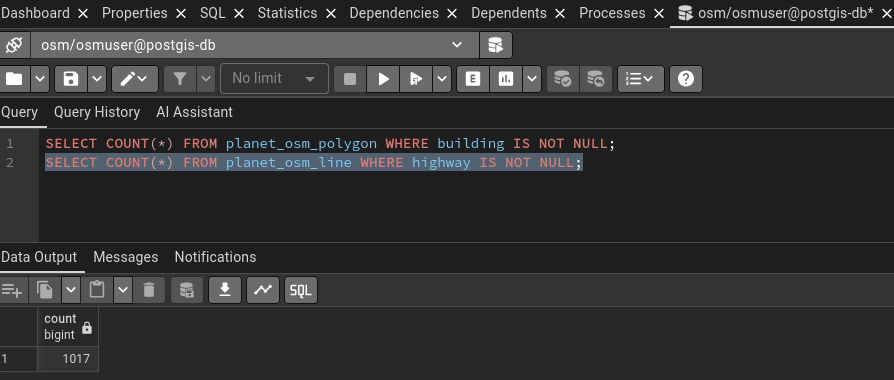

## 3. Data Preparation

### 3.1 Application Startup Log

The application started successfully as SchemaInitialization completed successfully.

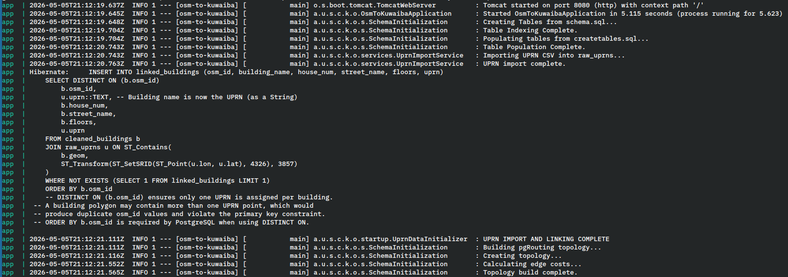

### 3.2 Cleaned Data Record Counts

The following queries were used as evidence that cleaned data was being produced.

```sql
SELECT COUNT(*) FROM cleaned_buildings;
SELECT COUNT(*) FROM cleaned_roads;
SELECT COUNT(*) FROM building_drop_points;
SELECT COUNT(*) FROM linked_buildings;
SELECT COUNT(*) FROM noded_streets;
```

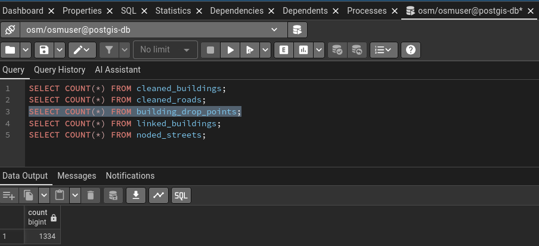

## 4. Infrastructure Prediction

### 4.1 Prediction Trigger

The prediction was triggered via `POST /predict/all` successfully.

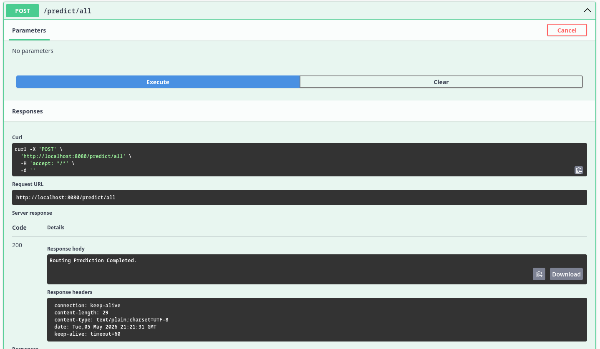

### 4.2 Network Point Record Count

The following query was used in pgAdmin to verify that the `network_points` table contained data.

```sql
SELECT type, COUNT(*) FROM network_points GROUP BY type ORDER BY type;
```

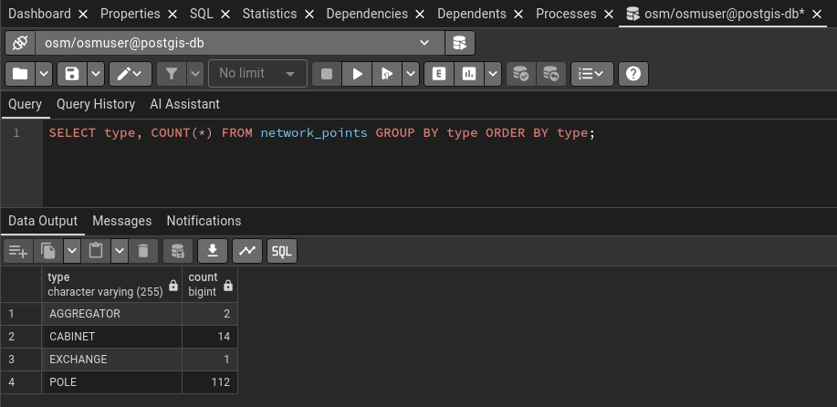

### 4.3 Network Connection Record Count

The following query was used in pgAdmin to verify that the `network_connections` table contained
data. 

```sql
SELECT link_type, COUNT(*) FROM network_connections GROUP BY link_type ORDER BY link_type;
```

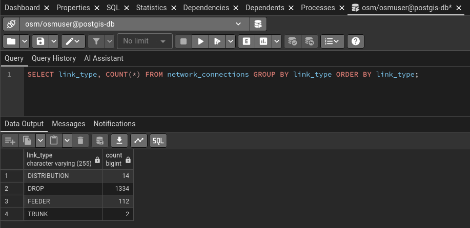

## 5. API Verification

### 5.1 Network Points Endpoint

Serialisable data was verified as present through the `GET network/points` endpoint.

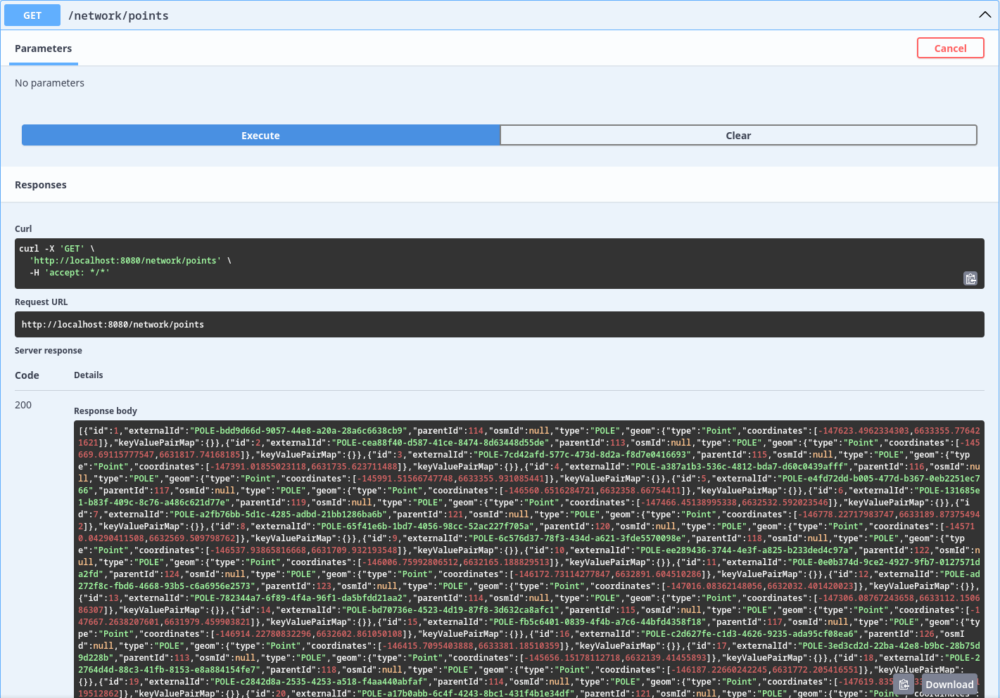

### 5.2 Network Connections Endpoint

Serialisable data was verified as present through the `GET network/connections` endpoint.

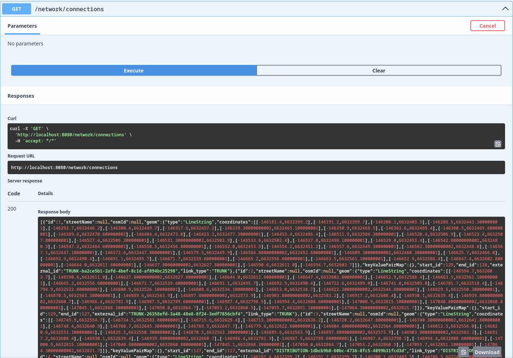

### 5.3 Kuwaiba Requisition Sample

Data was verified as retrievable through the Kuwaiba Requisition endpoint
`GET /kuwaiba-network/kuwaibaRequisition?pageNo=0&pageSize=10`.

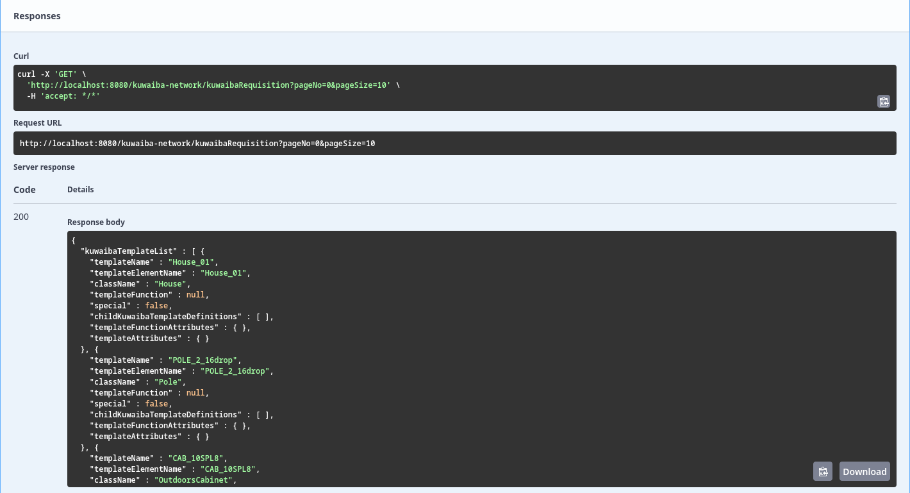

## 6. Visualisation

### 6.1 Network Map

The PostGIS database was loaded into QGIS to visually verify the predicted network.

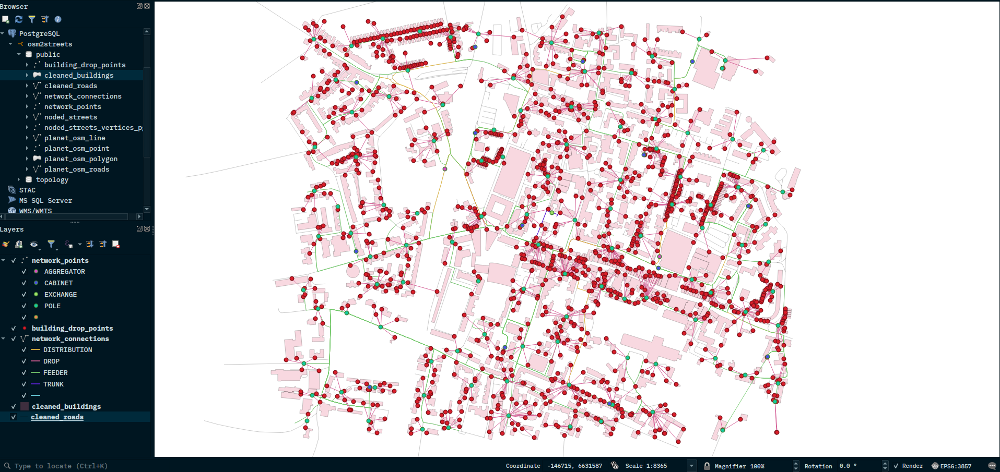

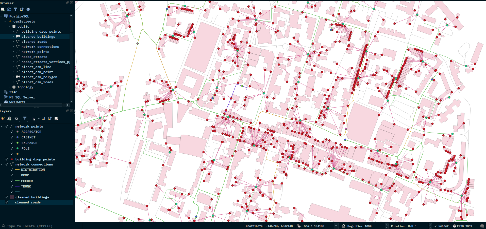

## 7. Summary

| Stage | Result |
|-------|--------|
| OSM Export (OSM2Streets) | Completed |
| OSM Import (osm2pgsql) | Completed |
| Data Preparation | Completed |
| Infrastructure Prediction | Completed |
| REST API | Responding |
| Kuwaiba Export | Valid requisition produced |

## 8. Pipeline Time Duration

The following is the time duration for the pipeline for the various stages:

|Stage|Start Time|End Time|Duration|
|-----|----------|--------|--------|
|Importer|21:59:16|21:59:17|1s|
|Data Preparation (createtables.sql)|21:59:23|21:59:24|1s|
|Prediction (predict/all)|22:07:03|22:07:04|1s|

### 8.1 Screenshot Evidence

**Importer Time**

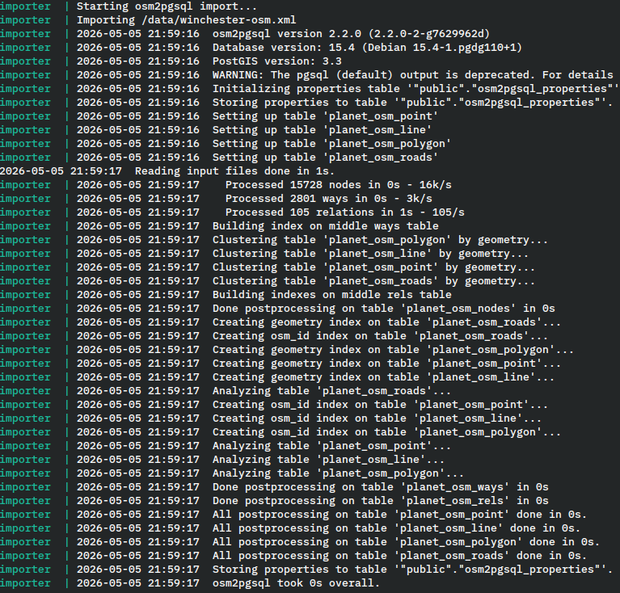

**Data Preparation Time**

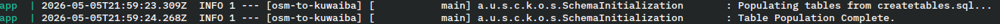

**Prediction Time**

First Timestamp

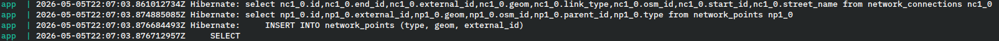

Last Timestamp


